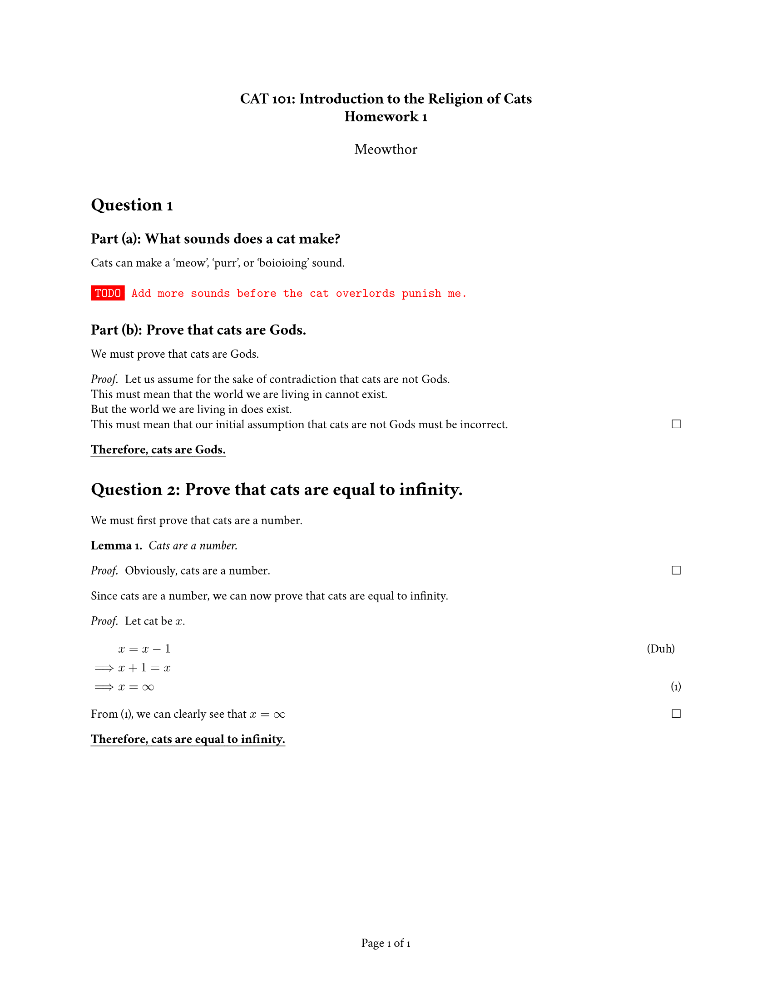

<h1 align="center">
  😺 Assignmeownt 😺
</h1>

<p align="center">
  A pretty LaTeX template for homework assignments.
</p>

<div align="center">
  <a href="./examples/assignment/assignment.pdf">
    
  </a>
</div>

<br />

## Preview

[](./examples/assignment/assignment.pdf)

## Quick Start

- [**[WILL BE ADDED SOON] Edit Assignment on Overleaf**](#)

**_Note:_ Above services do not guarantee up-to-date source code of Assignmeownt**

## How to Use

### Requirements

A full TeX distribution is assumed. [Various distributions for different operating systems (Windows, Mac, \*nix) are available](http://tex.stackexchange.com/q/55437) but TeX Live is recommended.
You can [install TeX from upstream](https://tex.stackexchange.com/q/1092) (recommended; most up-to-date) or use `sudo apt-get install texlive-full` if you really want that. (It's generally a few years behind.)

If you don't want to install the dependencies on your system, this can also be obtained via [Docker](https://docker.com).

### Usage

At a command prompt, run

```bash
xelatex {your-cv}.tex
```

Or using docker:

```bash
docker run --rm --user $(id -u):$(id -g) -i -w "/doc" -v "$PWD":/doc thomasweise/texlive make
```

In either case, this should result in the creation of `{your-cv}.pdf`

## Credits

[**LaTeX**](https://www.latex-project.org) is a fantastic typesetting program that a lot of people use these days, especially the math and computer science people in academia.

[**Awesome-CV**](https://github.com/posquit0/Awesome-CV) has a cool README template that I shamelessly copied.

## Contact

You can reach out to me on [**GitHub**](https://github.com/madhavan-raja) or [**LinkedIn**](https://www.linkedin.com/in/madhavan-raja/).
